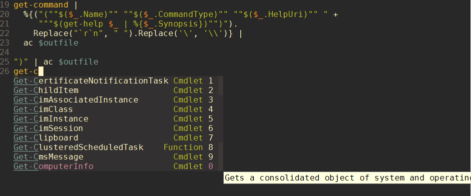

* *Author:* Noah Peart <noah.v.peart@gmail.com>
* *Maintainer:* Jen-Chieh Shen <jcs090218@gmail.com>
* *URL:* [https://github.com/nverno/company-powershell](https://github.com/nverno/company-powershell)

Description:

 Company autocompletion backend for powershell.  It will ask to create an
 index of commands when first invoked.  This takes a while, so `company-powershell`
 completion will disable itself until the process is finished.

 `company-show-location` ("M-.") looks up the online help in the browser
 for the completion
 candidate if available.

Example:

---

Converted from `company-powershell.el` by [*el2markdown*](https://github.com/Lindydancer/el2markdown).
